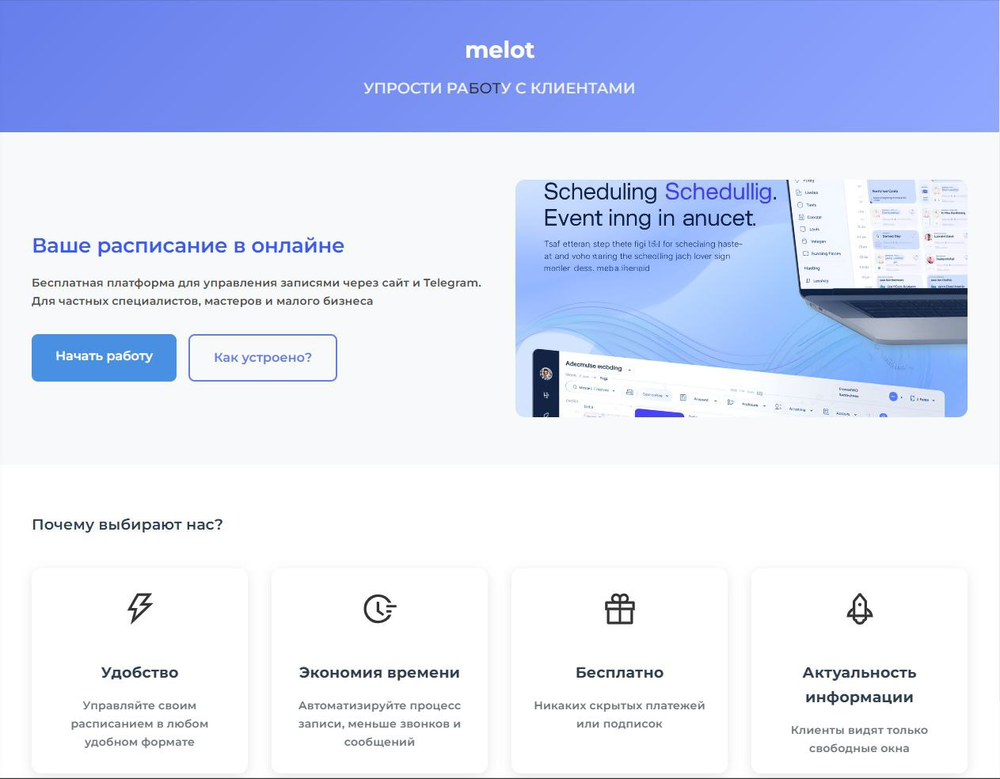
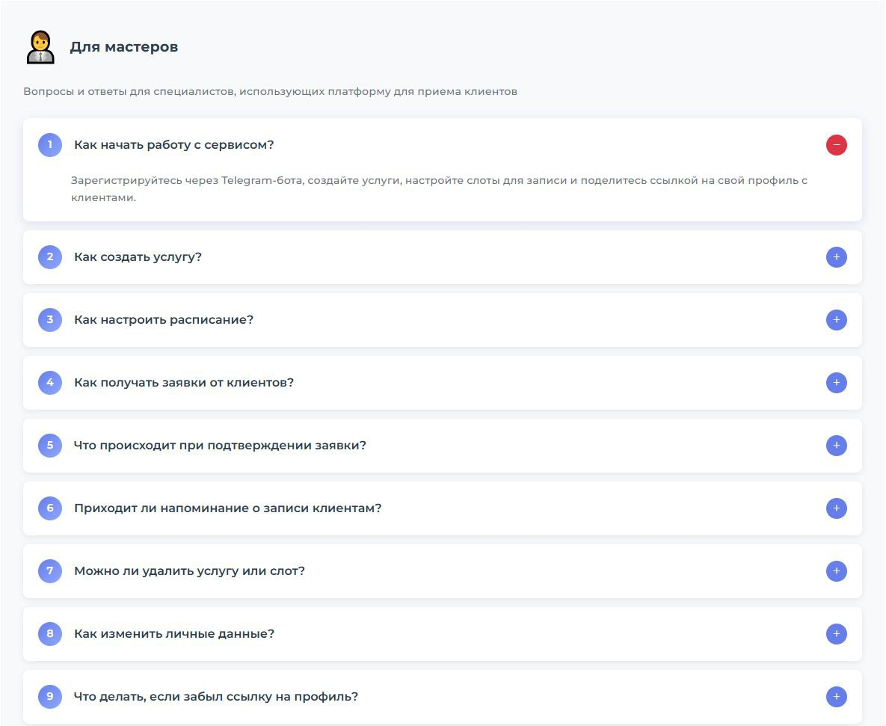
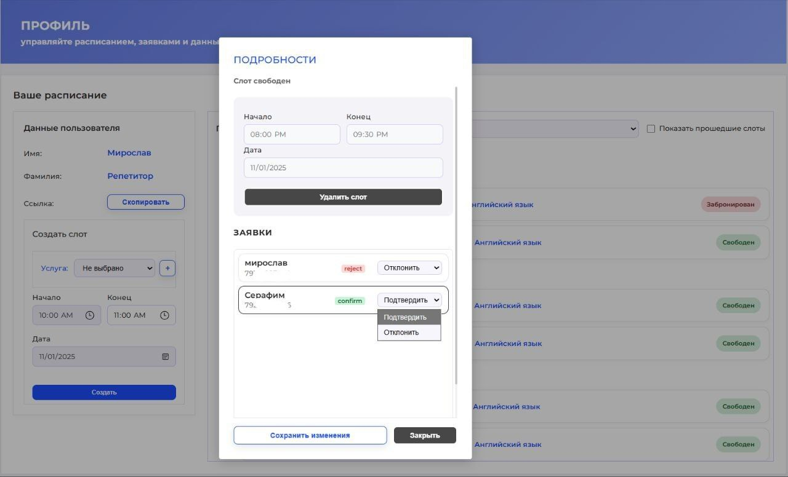
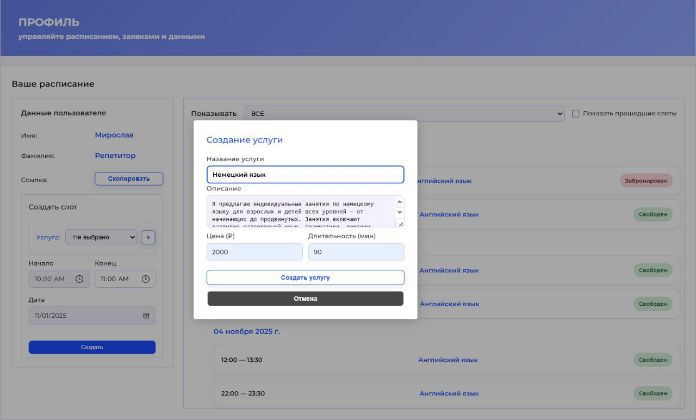
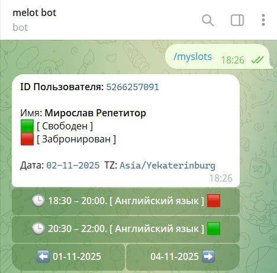

# Melot(Time Slot Hub) — публичный монорепозиторий продуктового уровня

Платформа для управления тайм‑слотами и онлайн‑записью, спроектированная как монорепозиторий с единым циклом разработки. Репозиторий демонстрирует **полный вертикальный срез продукта**: от базы данных и API до Telegram‑бота и SPA‑фронтенда.

Проект задуман как портфолио‑пример продакшен‑подхода: строгая слоистая архитектура, отдельные сервисы, продуманное завершение работы сервисов (graceful shutdown), планировщики фона и интеграция с мессенджером.

### Ключевые сценарии продукта

- **Онлайн‑запись к мастеру**: мастер создает публичные слоты, клиенты записываются на свободные окна.
- **Авторизация через Telegram**: связка веб‑интерфейса и Telegram‑бота с подтверждением входа.
- **Профиль мастера и клиента**: управление слотами, история записей, напоминания.
- **Уведомления и напоминания**: Telegram‑уведомления и in‑app‑нотификации за 1 час до записи.

---

## Архитектура монорепозитория

Монорепозиторий разделен на независимые, но согласованные сервисы:

- **Backend API (`backend/app`)**

  - Go + Gin, GORM, Swagger.
  - Доменно‑ориентированная структура: `controller` → `usecase` → `repository` → `models`.
  - Отдельные модули для пользователей, слотов, записей, уведомлений, ролей, админ‑метрик.
  - Встроенный планировщик (`internal/scheduler`) для отправки напоминаний перед записью.
  - Собственный пакет `pkg/closer` для централизованного graceful shutdown HTTP‑сервера, БД и фоновых задач.
- **Telegram‑сервис (`backend/telegram`)**

  - Отдельный сервис (микросервис‑подход) для Telegram‑бота.
  - Слой `adapter/backendapi` как HTTP‑клиент к основному API с внутренней аутентификацией.
  - Разделение по слоям: `domain`, `handlers`, `app`‑сервисы (логин, слоты, записи), `transport` (бот и HTTP‑эндпоинты).
  - Поддержка rate limiting и middleware для безопасной обработки входящих обновлений.
- **Frontend SPA (`frontend/react-vite`)**

  - React + Vite, React Router, TanStack Query, Axios.
  - Основные маршруты: `/`, `/login`, `/login/wait`, `/profile`, публичная страница мастера, админ‑раздел.
  - Dev‑proxy (`vite.config.js`) прозрачно проксирует `/user`, `/slot`, `/record` на Backend API.
  - Четкое разделение на `pages`, переиспользуемые `components`, `utils`, `config`.
- **Инфраструктура**

  - `docker-compose.yml` для локального запуска БД, API, фронтенда и Telegram‑сервиса.
  - Конфигурация через `.env`‑файлы (есть `.env.example`‑рекомендации в подмодулях).

---

## Технологический стек

- **Backend**

  - Go, Gin, GORM (PostgreSQL‑совместимая БД).
  - Swagger / OpenAPI для самодокументируемого API.
  - Logrus‑логирование с отдельным `internal/logger`.
  - Встроенный планировщик на Go (`context` + `time.Ticker`) для фоновых задач.
- **Telegram‑сервис**

  - Go, Telegram Bot API.
  - Собственный HTTP‑транспорт и адаптер к основному API.
- **Frontend**

  - React + Vite, React Router, @tanstack/react‑query, Axios.
  - Классический SPA‑подход с клиентским роутингом и кэшированием запросов.

---

## Реализация

- **Graceful shutdown всего контура**

  - Пакет `pkg/closer` реализует менеджер, который:
    - Подписывается на системные сигналы (`SIGINT`, `SIGTERM`).
    - Останавливает HTTP‑сервер, планировщик напоминаний и соединение с БД в контролируемом порядке.
    - Работает с контекстами и таймаутами, чтобы не терять запросы при остановке.
  - Telegram‑сервис использует схожий подход с контекстами для остановки бота и HTTP‑части.
- **Слоистая архитектура и разделение ответственности**

  - HTTP‑слой (Gin‑хендлеры) не содержит бизнес‑логики — только разбор запросов и формирование ответов.
  - `usecase`/`service`‑слой инкапсулирует бизнес‑правила (создание слотов, букинг, отмена, админ‑операции).
  - `repository`‑слой изолирует работу с БД (GORM), что упрощает тестирование и эволюцию схемы.
- **Фоновые задачи и уведомления**

  - Планировщик раз в минуту сканирует подтвержденные записи и отправляет напоминания за 1 час до слота.
  - Гибкое определение таймзон мастера и клиента, формирование человекочитаемых уведомлений.
  - Дублирование уведомлений: Telegram + запись в таблицу уведомлений для фронтенда.
- **Безопасность и конфигурация**

  - Критичные значения (токены бота, пароли, секреты JWT) вынесены в переменные окружения.
  - Рекомендованные `.env.example` и расширенный `.gitignore` для безопасной публикации кода.
  - Middleware‑слой: аутентификация, сессии, rate limiting, санитайзинг входящих данных.
- **Наблюдаемость и админ‑функционал**

  - Отдельные контроллеры и репозитории для метрик и админ‑панели.
  - Структурированное логирование ключевых событий (старты/остановки сервисов, ошибки, фоновые задачи).

#### Дополнительные детали

- Подробная документация по Backend API, структуре слоев и Telegram‑сервису: см. `backend/README.md`.
- Детали по фронтенду, роутам и интеграции с API: см. `frontend/README.md`.

## Как выглядит

### Веб-интерфейс

|            Вкладка «Главная»            |             Вкладка «Инфо»             |
| :------------------------------------------------------: | :-------------------------------------------------: |
|  |  |

|  Вкладка «Профиль» — Управление слотом  |                    Создание услуги                    |
| :----------------------------------------------------------------------: | :------------------------------------------------------------------: |
|  |  |

### Интеграция с Telegram-ботом

|            Работа со слотами            | **Уведомление о новой записи** |
| :------------------------------------------------------: | :---------------------------------------------------------: |
|  |        |

## Быстрый старт

### Способ 1. Через Docker (рекомендуется для демо)

#### Клонировать репозиторий

```bash
git clone https://github.com/yourname/TimeSlot-Hub.git
cd TimeSlot-Hub
```

#### Настроить окружение

```bash
cp backend/app/.env.example backend/app/.env
cp backend/telegram/.env.example backend/telegram/.env
# отредактируйте .env файлы под вашу конфигурацию
```

#### Запустить все сервисы

```bash
make up
```

#### После запуска:

* **Frontend** : [http://localhost:3000](http://localhost:3000/)
* **Backend API** : [http://localhost:8090](http://localhost:8090/)
* **Swagger UI** : [http://localhost:8090/swagger/index.html](http://localhost:8090/swagger/index.html)
* **Telegram Bot** : работает в фоне (порт 8091)

### Способ 2. Локальная разработка (без Docker)

#### Установить зависимости

```bash
make deps-all
```

#### Запустить в трёх терминалах:

**Терминал 1 — Backend API:**

```bash
make backend-dev
```

*Сервер будет на [http://localhost:8090](http://localhost:8090/)*

**Терминал 2 — Frontend:**

```bash
make frontend-dev
```

*Приложение будет на [http://localhost:5173](http://localhost:5173/)*

**Терминал 3 — Telegram Bot:**

```bash
make telegram-dev
```

## Доступные команды Makefile

```bash
# Полный список команд
make help

# Основные сценарии использования:

# 1. Запуск через Docker (рекомендуется)
make up

# 2. Локальная разработка (в разных терминалах)
make backend-dev      # Бэкенд API на порту 8090
make frontend-dev     # Фронтенд на порту 5173
make telegram-dev     # Telegram бот

# 3. Установка зависимостей
make deps-all         # Все зависимости
make deps-backend     # Только Go зависимости
make deps-frontend    # Только Node.js зависимости

# 4. Мониторинг
make logs             # Все логи
make logs-app         # Логи бэкенда
make logs-bot         # Логи Telegram бота
make logs-frontend    # Логи фронтенда
make ps               # Статус контейнеров

# 5. Очистка
make clean            # Остановить контейнеры и очистить тома
make clean-all        # Полная очистка системы
```
